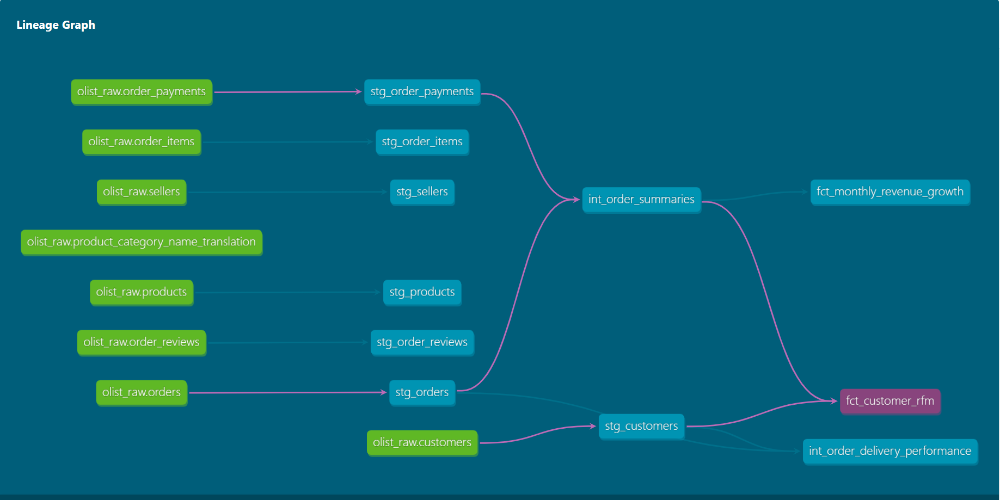
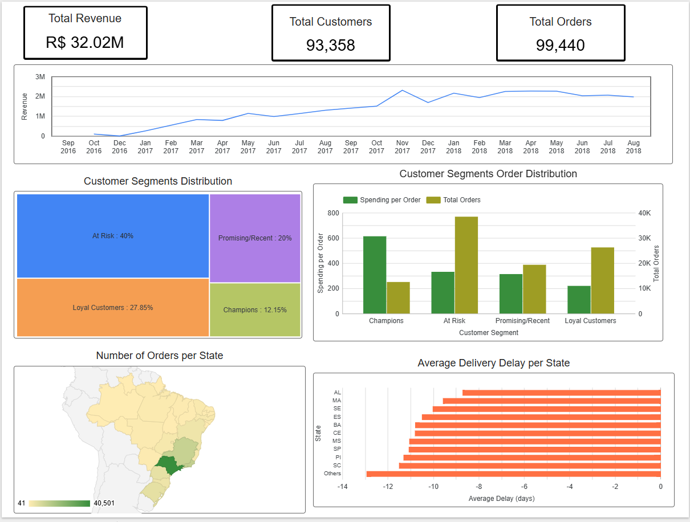

# Technical Case Study: Olist Analytics Engineering

**Author:** Sarim Rizvi

**Stack:** Snowflake, dbt-core, Apache Airflow, Looker Studio

## Table of Contents
* [1. The Business Context (The Story)](#business-story)
* [2. Data Overview](#data-overview)
* [3. Engineering Strategy: The Medallion Architecture](#engineering-strategy)
* [4. dbt: The Logic Engine](#dbt)
* [5. Airflow: Programmatic Orchestration](#airflow)
* [6. The "Last Mile": Strategic Dashboard & Discovery](#dashboard)
* [7. Skills Inventory](#skills)

## 1. The Business Context (The Story) <a name="business-story"></a>

The **Olist Marketplace** is a complex ecosystem connecting thousands of small Brazilian businesses to national customers. The leadership team faced three critical "blind spots" that this project was designed to illuminate:

1. **Retention:** Which customers are high-value "Champions" and who is about to churn?
2. **Growth:** Is our revenue scaling month-over-month, or are we reliant on seasonal peaks?
3. **Trust:** Are we meeting our delivery promises, or is the "Last Mile" damaging our brand?

## 2. Data Overview & Exploratory Analysis <a name="data-overview"></a>
The project utilises the **[Olist Brazilian E-Commerce Dataset](https://www.kaggle.com/datasets/olistbr/brazilian-ecommerce)**, a real-world multi-dimensional dataset containing 100,000 orders from 2016 to 2018. The data is highly relational, requiring complex joins across 8 distinct tables.

### Dataset Statistics
* **Total Orders:** 99,441
* **Unique Customers:** 96,096
* **Product Categories:** 71 unique segments
* **Time Period:** Sept 2016 – Sept 2018
* **Geographic Scope:** 27 Brazilian States

### Entity Relationship Summary
To build the Medallion pipeline, I mapped the following core entities:
* **Orders (`stg_orders`):** The central fact table containing timestamps for purchase, approval, and delivery.
* **Order Items (`stg_order_items`):** The granular line-item level (Order ID + Product ID) used for revenue calculations.
* **Customers (`stg_customers`):** Linked via a non-intuitive `customer_id` (per order) and `customer_unique_id` (per person).
* **Payments (`stg_payments`):** Captures split payment methods (credit card, voucher, *boleto*) and installment counts.


### Data Quality Challenges Identified
During the initial EDA phase, I identified several "dirty data" patterns that informed my dbt testing strategy:
1.  **Duplicate Sellers:** 0.2% of sellers had multiple entries with conflicting city data.
2.  **Missing Timestamps:** Approximately 3% of "delivered" orders were missing an `order_approved_at` timestamp.
3.  **Estimated vs. Actual:** A significant delta existed between delivery estimates and reality, which became the basis for the **Logistics Performance Mart**.


## 3. Engineering Strategy: The Medallion Architecture  <a name="engineering-strategy"></a>

I implemented a **Medallion (Bronze/Silver/Gold) Architecture** to transform raw, messy CSV data into governed, high-performance analytical assets.

### Snowflake: Infrastructure as a Foundation

I utilised Snowflake as the central warehouse, enforcing strict environment isolation:

* **Database Design:** Segregated `OLIST_RAW` (Bronze), `OLIST_DEV` (Sandbox), and `OLIST_ANALYTICS` (Production).
* **Performance:** Configured a dedicated `X-Small` warehouse for dbt transformations to optimise costs while ensuring query speed.
* **Snowflake Scaling:** Utilised an `X-Small` Multi-Cluster Warehouse. While the dataset is ~100k rows, I treated the architecture as **Big Data Ready** by implementing incremental loading logic in dbt to minimise partition scanning.
* **Semi-Structured Data:** Handled Brazilian Portuguese character encoding (UTF-8) within Snowflake to ensure city and state names (like *São Paulo*) rendered correctly in the final **Looker Studio** geomap.


## 4. dbt: The Logic Engine <a name="dbt"></a>

The core of my work lives in the dbt layer, moving away from "Monolithic SQL" toward **Modular, DRY (Don't Repeat Yourself)** code.

### A. Staging Layer (The Silver Bridge)

I discovered that the raw Olist dataset contained duplicate primary keys for `product_id` and `seller_id`. I implemented a deduplication strategy using **Window Functions** to ensure data integrity for all downstream metrics.

```sql
/* stg_products.sql - Strategic Deduplication */
with raw_source as (
    select * from {{ source('olist_raw', 'products') }}
),
deduplicated as (
    select 
        *,
        row_number() over (partition by product_id order by product_category_name) as row_num
    from raw_source
)
select * exclude row_num
from deduplicated
where row_num = 1

```

### B. Intermediate Layer (Complex Business Logic)

To solve the "Trust" blind spot, I engineered a delivery performance model. This required joining 100k+ orders with customer geographics to calculate **SLA slippage** across the diverse Brazilian landscape.

```sql
/* int_order_delivery_performance.sql */
select
    o.order_id,
    c.customer_state,
    -- Time-series delta calculations
    datediff('day', o.order_purchase_timestamp, o.order_delivered_customer_date) as actual_delivery_time,
    datediff('day', o.order_estimated_delivery_date, o.order_delivered_customer_date) as delivery_delay,
    -- Conditional KPI flagging
    case 
        when o.order_delivered_customer_date > o.order_estimated_delivery_date then 1 
        else 0 
    end as is_late_delivery
from {{ ref('stg_orders') }} o
left join {{ ref('stg_customers') }} c on o.customer_id = c.customer_id

```

### C. Marts Layer (Gold Standard Insights)

For the "Retention" blind spot, I implemented an **RFM (Recency, Frequency, Monetary)** model. By utilising `NTILE(5)` functions, I created a dynamic segmentation engine that updates with every pipeline run.

```sql
/* fct_customer_rfm.sql - Advanced Analytical Pattern */
with user_scores as (
    select
        customer_unique_id,
        ntile(5) over (order by last_order_date) as r_score,
        ntile(5) over (order by count_orders) as f_score,
        ntile(5) over (order by total_revenue) as m_score
    from {{ ref('int_customer_transactions') }}
)
select *, (r_score || f_score || m_score) as rfm_combined
from user_scores

```

### The Lineage Graph
This graph serves as the "Blueprints" for the project. It highlights the transformation of 8 raw tables into a consolidated RFM Marketing Mart and a Logistics Performance Mart. By visualizing these relationships, I ensured that changes to upstream staging models (like deduplicating products) automatically and reliably propagated to the executive dashboard.



## 5. Airflow: Programmatic Orchestration <a name="airflow"></a>

To move into "Phase 2" of data maturity, I authored a Python-based **Airflow DAG**. This demonstrates an understanding of **Modern Data Stack (MDS)** orchestration beyond simple manual triggers.

* **API Management:** Integrated with dbt Cloud's API using `DbtCloudRunJobOperator`.
* **State Awareness:** Implemented `DbtCloudJobRunSensor` to ensure the pipeline is resilient, only proceeding if upstream tests pass.


## 6. The "Last Mile": Strategic Dashboard & Discovery <a name="dashboard"></a>

The project culminated in an executive dashboard in **Looker Studio**, which led to a major **Business Discovery**:

> **The Delivery Paradox:** While I expected to find late deliveries, the data revealed that Olist consistently beats its estimates by **8–20 days**.

> **Actionable Recommendation:** I identified a strategic opportunity to reduce "Promised Delivery Windows" by **15%**, which would likely increase customer conversion rates and improve brand trust in competitive states like São Paulo.



**[View Interactive Dashboard](https://lookerstudio.google.com/s/jrxRFB0w0cI)**

## 7. Skills Inventory <a name="skills"></a>

| Skill | Technical Implementation |
| --- | --- |
| **SQL Mastery** | CTEs, Window Functions (`row_number`), `NTILE` Ranking, `datediff`. |
| **Data Architecture** | Medallion Pattern, Star Schema, Entity Relationship Modelling. |
| **Software Engineering** | Version Control (Git), DRY principles, Documentation-as-Code. |
| **Data Quality** | automated `unique` and `not_null` testing, schema validation. |
| **Orchestration** | Python Airflow DAGs, Sensor-driven tasks, API integrations. |

---